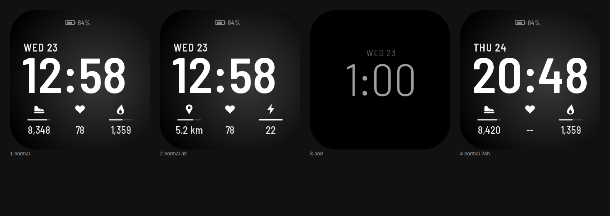

# Sense Minimal: Fitbit Sense clock face

A monochrome, minimalist clock face for the **Fitbit Sense** (336 × 336), built on the official Fitbit SDK 6.1. It's black and white with a soft grey glow, and all text is set in **Barlow Semi Condensed**. The time is the dominant element. The date sits above it, and three tappable metric slots run along the bottom. Each slot has an icon, a goal-progress bar and a value. A dim, burn-in-safe **Always-On Display** mode is included.



*Preview rendered by the headless smoke test from the same glyph images the watch uses. The only approximation is the background glow's falloff.*

| Shown | Source (Fitbit API) | Updates |
|---|---|---|
| Time | `clock` (minute granularity) + `user-settings.preferences.clockDisplay` | every minute |
| Date / weekday | `Date` from the clock tick | when the day changes |
| Steps, calories, distance, floors, AZM + goal bars | `user-activity` `today.adjusted` / `goals` | every minute + on wake |
| Heart rate | `heart-rate` `HeartRateSensor` + `body-presence` | live, screen-on only |
| Battery % | `power.battery` `change` event | when it changes |
| AOD | `display.aodAvailable / aodAllowed / aodActive` | minute tick only |

---

## 1. Requirements

- **Node.js 18 LTS** is recommended; 16–22 are known to build. Using [`nvm`](https://github.com/nvm-sh/nvm) lets you switch versions.
- **A Fitbit account** that is signed in on the phone paired with your Sense.
- **Fitbit OS Simulator** (optional). It runs on **Windows and macOS only**; Fitbit has not shipped a Linux build.
- **Linux only:** `@fitbit/sdk-cli` depends on `keytar`, which needs `libsecret`. Install it with:
  `sudo apt install libsecret-1-dev` (Debian/Ubuntu) or `sudo dnf install libsecret-devel` (Fedora).
- **Optional:** Python 3 + Pillow (`pip install pillow`), only needed to regenerate the placeholder icons.

## 2. Fitbit SDK setup

The SDK is an npm dev-dependency, so nothing is installed globally:

```bash
cd fitbit-sense-clockface
npm install
```

That installs:

- `@fitbit/sdk` 6.1: the build toolchain (`fitbit-build`). SDK 6.x targets **Sense (`vulcan`)** and Versa 3 (`atlas`).
- `@fitbit/sdk-cli`: the `fitbit` debugger shell, used to install onto the watch or the simulator.
- `esbuild`: used only by the local smoke test.

The build target is set to Sense only in `package.json → fitbit.buildTargets: ["vulcan"]`. To also ship for Versa 3, add `"atlas"`; it has the same 336 × 336 screen.

> Fitbit Studio (the old browser IDE) has been retired. The CLI above is the supported route.

## 3. Project structure

```
fitbit-sense-clockface/
├── package.json            # Fitbit manifest: UUID, permissions, build targets
├── app/                    # runs on the watch
│   ├── index.js            # entry point: wiring only
│   ├── config/             # ◀ everything a designer edits
│   │   ├── theme.js        #   colours, fonts, type sizes, background
│   │   ├── glyphs.js       #   GENERATED bitmap-font metrics (npm run glyphs)
│   │   ├── layout.js       #   every x/y/size (normal + AOD), safe area
│   │   └── settings.js     #   time/date format, which metrics, taps, AOD
│   ├── core/               # pure logic, no Fitbit imports
│   │   ├── time.js         #   time + date formatting
│   │   └── format.js       #   number formatting, progress maths
│   ├── data/               # Fitbit sensors & APIs; never touch the DOM
│   │   ├── activity.js     #   steps/calories/distance/floors/AZM + goals
│   │   ├── heartRate.js    #   HR sensor + on-wrist detection
│   │   ├── battery.js      #   battery level events
│   │   └── metrics.js      #   ◀ metric registry (id → data, format, icon)
│   ├── ui/                 # drawing only; never touch sensors
│   │   ├── dom.js          #   change-guarded setters (no redundant redraws)
│   │   ├── label.js        #   text via bitmap font OR system font
│   │   ├── face.js         #   builds all components once
│   │   ├── background.js   #   gradient / image / solid
│   │   ├── clockText.js    #   time + date (normal & AOD placement)
│   │   ├── battery.js      #   vector battery glyph + %
│   │   ├── slots.js        #   metric slots: icon, bar, value
│   │   └── interaction.js  #   tap-to-cycle
│   ├── modes/
│   │   ├── controller.js   #   display state machine: NORMAL ⇄ AOD ⇄ OFF
│   │   ├── normal.js       #   full face behaviour
│   │   └── aod.js          #   always-on behaviour
│   └── state/store.js      # remembers the selected slot metrics
├── resources/              # packaged onto the watch
│   ├── index.view          # element skeleton (ids + paint order)
│   ├── styles.css          # fallback styles only
│   ├── widget.defs
│   ├── icon.png            # 80×80 app icon (required size)
│   ├── icons/*.png         # 26×26 grayscale metric icons (tintable)
│   ├── glyphs/<set>/*.png  # bitmap font: one grayscale PNG per character
│   └── bg/background.jpg   # optional raster background
├── tools/
│   ├── smoke/              # headless test: real app code + mocked Fitbit APIs
│   ├── generate_glyphs.py  # font file → glyph PNGs + glyphs.js
│   ├── generate_icons.py   # regenerates the placeholder art
│   └── fonts/              # Barlow Semi Condensed (SIL OFL 1.1)
├── DESIGN.md               # Figma → clock face handbook
└── docs/preview.png
```

The data flow runs one way: **data → modes → ui**. `ui/` never imports a sensor, and `data/` never imports `document`. You can therefore replace the whole look without touching sensor code.

## 4. Build

```bash
npm run build          # → build/app.fba
```

Two warnings are expected, *"built without a companion component"* and *"…without a settings component"*. This face needs no phone-side code. See "Limitations" for why.

Before building on the watch, you can run the local checks:

```bash
npm run smoke          # ~40 behavioural checks against mocked Fitbit APIs
npm run preview        # same + renders tools/smoke/out/preview.png (needs Chrome/Chromium)
```

The smoke test bundles the real `app/` code and walks it through normal → tap → AOD → screen off → wake → off-wrist → 24h. It also fails if code sets an element property or style that the Fitbit SVG API doesn't support.

## 5. Run in the simulator

1. Install **Fitbit OS Simulator** (Windows/macOS) from the Fitbit developer site, then launch it.
2. In the simulator's settings, choose **Device → Fitbit Sense**.
3. In the project folder, run:
   ```bash
   npx fitbit
   fitbit$ build-and-install      # or: bi
   ```
   The first time, `npx fitbit` opens a browser so you can sign in to your Fitbit account.
4. Use the simulator panels to change heart rate, steps, battery and **AOD**, and to switch the 12h/24h setting.

## 6. Install on your Fitbit Sense

1. On the phone, open the **Fitbit app → Today → your profile → Sense → Developer Menu** and turn on **Developer Bridge**. If the Developer Menu is missing, tap the watch image repeatedly or check the Fitbit community for your app version.
2. On the watch, open **Settings → Developer Bridge**. On some firmware it's under *Settings → About*. Wait until it says **Connected to server**. Keep the watch on its charger for a stable connection.
3. On your computer, run:
   ```bash
   npx fitbit
   fitbit$ build-and-install
   ```
4. The face installs and becomes active. `fitbit$ logs` streams `console.log` output from the watch.

**Keeping the face installed.** A sideloaded face stays on the watch until you install another face. To distribute it, upload `build/app.fba` in the Fitbit **Gallery App Manager** (gam.fitbit.com).

**Accounts.** Fitbit is moving accounts to Google accounts. If `npx fitbit` login fails for a migrated account, check the Fitbit developer community for the current sign-in route. This part of the tooling hasn't been updated since SDK 6.1.

## 7. Modify the design

Every visual value lives in `app/config/`. For a full Figma workflow, see **[DESIGN.md](DESIGN.md)**.

| I want to… | Edit |
|---|---|
| Move something | `app/config/layout.js`: x/y/size per element; `NORMAL` and `AOD` are separate |
| Change colours / fonts / sizes | `app/config/theme.js` |
| Change what's shown / formats | `app/config/settings.js` |
| Swap an icon | Replace the file in `resources/icons/` (same name, 26×26 grayscale PNG) |
| Use a raster background | `theme.js → BACKGROUND.type = "image"` and drop your file at `resources/bg/background.jpg` |
| Add a new element | Add it to `resources/index.view` with an id, then style/position it in a `ui/` component |

After each change, run `npm run preview` to check quickly, then use `build-and-install` to see the real thing.

## 8. Colours

All colours are defined in one object, `COLORS`, in `app/config/theme.js`:

```js
glowInner: "#3A3A3A",   // soft grey glow behind the time
textPrimary: "#FFFFFF", // time
progress: "#D6D6D6",    // goal bars
goalReached: "#FFFFFF", // bars brighten to white at 100%
aodTime: "#9E9E9E",     // keep AOD colours dim
```

Use `#RRGGBB`. Don't rely on alpha in hex values; set transparency with the `opacity` field on a `TYPE` style instead. Icons pick up `COLORS.icon` automatically, because they are grayscale masks.

## 9. Typography

All text is drawn in **Barlow Semi Condensed**. Fitbit can't load font files, so the face uses a **bitmap font**: every character is pre-rendered as a small grayscale PNG, and `app/ui/label.js` lays the characters out and tints them with the theme colours.

| Style | Weight | Size | Used for |
|---|---|---|---|
| `time` | SemiBold 600 | 120 | hero time |
| `timeAod` | Light 300 | 108 | AOD time |
| `date` | SemiBold 600 | 26 | date |
| `dateAod` | Regular 400 | 22 | AOD date |
| `value` | Medium 500 | 25 | metric values |
| `battery` | Medium 500 | 17 | battery % |

- **Change sizes, weights or characters:** edit the `SETS` table in `tools/generate_glyphs.py`, then run `npm run glyphs`. That regenerates `resources/glyphs/` and `app/config/glyphs.js`.
- **Use a different typeface:** put its `.ttf`/`.otf`/`.woff` file in `tools/fonts/`, point `SETS` at it, and run `npm run glyphs`.
- **Change spacing and colour** (no regeneration needed): edit `letterSpacing` and `fill` in `TYPE` in `theme.js`.
- **Go back to Fitbit's system font (Raiju):** set `USE_BITMAP_FONT = false` in `theme.js`. The system sizes come from `fontSize` in each `TYPE` style.
- **Figma:** Barlow Semi Condensed is a free Google Font, so the Figma file can use the exact same font as the watch.

## 10. Add or remove metrics

The bottom slots are configured in `app/config/settings.js`:

```js
export const SLOTS = [
  ["steps", "distance", "floors"], // tap cycles through these
  ["heartRate"],                    // single metric → tap does nothing
  ["calories", "azm"]
];
```

- **Remove a metric:** delete its id from the list.
- **Use fewer slots:** use 1–3 lists, and set matching `layout.js → NORMAL.slots.centers`.
- **Add a new metric type:** add an entry to `app/data/metrics.js` with `icon`, `value()`, an optional `goal()` and `format()`. Add its icon to `resources/icons/`, then reference its id in `SLOTS`. If the metric needs a new permission, add it to `package.json → fitbit.requestedPermissions`.
- **Hide the battery:** set `settings.js → BATTERY.show = false`.

## 11. Debugging common problems

| Symptom | Cause / fix |
|---|---|
| `npm install` fails on `keytar` / `libsecret-1` | Linux: install `libsecret-1-dev`, then reinstall. Only the CLI needs it; `npm install --ignore-scripts` still lets `npm run build` work. |
| `Missing element #xyz in resources/index.view` | An id was renamed or removed in `index.view` but is still used in `app/ui/`. Keep ids in sync. |
| `Unknown metric id in settings.SLOTS` | A typo in `SLOTS`, or the id is missing from `data/metrics.js`. |
| Values show `--` | The permission is not granted. Re-grant it in **Fitbit app → clock face → Permissions**. HR also shows `--` when the watch is off-wrist. |
| A character is missing or shows a gap | It isn't in that glyph set. Add it to `SETS` in `tools/generate_glyphs.py` and run `npm run glyphs`. The `fitbit$ logs` output names the missing glyph. |
| Icon appears as a solid square | The PNG is RGB/RGBA, not **grayscale**. Re-export it as 8-bit grayscale (white = visible). |
| Steps lag by up to a minute | This is by design: activity is read on each minute tick and on wake, to save battery. |
| AOD never shows the face | AOD must be on under *Watch Settings → Display → Always-on display*. Also, `access_aod` is a **restricted** permission; see "Limitations". |
| Developer Bridge won't connect | Put the watch on its charger. Toggle the bridge on both the phone and the watch. Make sure the phone and computer are online and signed in to the same account. |
| Text clipped at the corners | Stay inside `SAFE_AREA` in `layout.js`, and remember text `y` is the **baseline**. |
| `console.log` output | Run `fitbit$ logs` in the CLI shell. |

---

## Limitations (Fitbit SDK / Sense)

These were checked against the SDK 6.1 toolchain source and API surface. Nothing is faked; each item notes the closest supported alternative.

1. **Always-On Display is a restricted permission.** SDK 6.1 lists `access_aod` as *"[Restricted] Always-on Display"*. The code requests it and only enables AOD when `display.aodAvailable && me.permissions.granted("access_aod")`. If Fitbit doesn't grant it (for example, a Gallery submission without approval), the face falls back cleanly: the screen turns off as normal. The AOD code path is fully implemented and unit-tested with mocks, but whether a sideloaded build gets the permission is decided by Fitbit's servers, not by this code.
2. **Custom fonts can't be loaded.** Fitbit only has its system fonts. This face works around that with a bitmap font (pre-rendered PNG glyphs), which is why Barlow works. The catch: sizes are fixed when the glyphs are generated, and there's no kerning, only per-character advance widths.
3. **Activity data has no change event.** `user-activity` can only be polled. The face reads it once a minute and on wake, instead of every second.
4. **No settings page yet.** A phone-side settings UI (colour pickers and similar) needs a companion + settings component plus messaging, which is a meaningful memory and complexity cost. The values are compile-time config for now. The architecture leaves room to add one later: `settings.js` values would be overridden at runtime.
5. **Rounded rectangles aren't available.** Fitbit `<rect>` has no corner radius. Progress bars are square-ended, which reads fine at 4 px. For pill ends, use a PNG.
6. **Simulator OS support.** The simulator is Windows/macOS only. On Linux, use `npm run preview` plus a real watch.
7. **English day/month names.** The JS engine has no `Intl`. Names live in `app/core/time.js` and can be translated in place.
